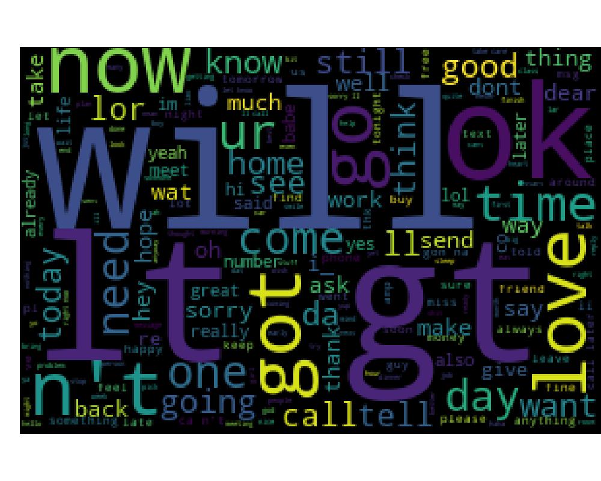
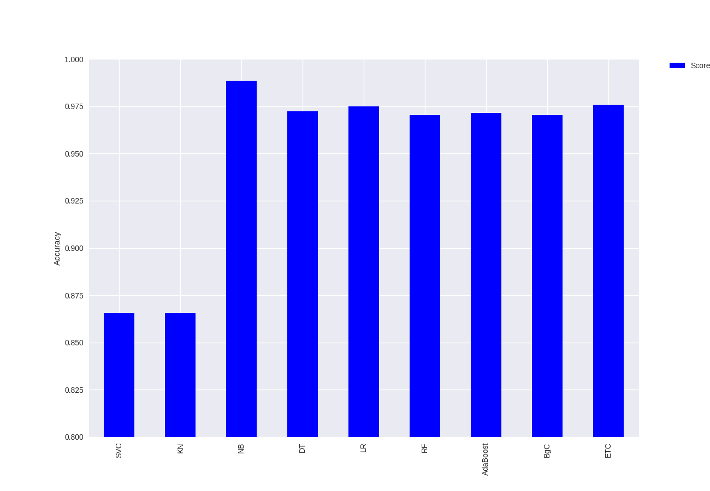

# Prediction of SMS SPAMs for Mobile Devices

The use of SMS is very recurrent to send small messages, however with the increase of the use of mobile devices has made it increase the sending of SPAM messages, which hinders the usability of the device. From this problem, use solution would predict from the characteristics of the text if the message is SPAM.

The following research question was created:

**Q1: Is it possible to predict SMS text as SPAM based on text characteristics?**

To answer this research question was used a database containing 5574 messages, divided into 4827 messages considered not SPAM and 747 messages considered SPAM. The base can be viewed in [repository](/data/spam.csv).

From this file the text was pre-processed. For this step the tool [NLTK](http://www.nltk.org/) was used. This step involved removing invalid characters and special characters that would interfere with the prediction.

After the preprocessing, the [scikit-learn](http://scikit-learn.org/stable/) tool  was used, which is a Python tool that implements a set of classification techniques. The following techniques were used for the experiment.

- Support Vector Classification (SVC);
- K NNeighbors Classifier (KNN);
- Decision Tree (DT);
- Logistic Regression (LR);
- Random Forest (RF);
- Ada Boost;
- Bagging Classifier (BgC);
- Extra trees classifier (ETC).

## Results

First it was visualized that the base presents some repeated texts, among the 5574 messages, 403 were repeated messages

From these repetitions an interesting frequency of sentences was visualized. The table displays this frequency. In the context of non-SPAM messages, the most frequent phrases were "Sorry, I'll call later", this situation can be answered because some cell phones have the option to notify the contact that made the connection that at that moment can not answer the call. In the situation of messages considered SPAMs the most frequent phrase was "Please call our curstomer service", which are messages sent by mobile operators to request a modification in customer service.

| **Label** | **Message** | **Frequency** |
|-------|---------|-----------|
| ham | Sorry, I’ll call later | 30 |
| spam | Please call our customer service | 4 |

With pre-processing the words are displayed more frequently.


*words in non-SPAM messages*


*words in SPAM messages*

With the pre-processing we perform the classification and the results can be seen in the Table.

| **Classifier** | **Result **|
|------------|--------|
| SVC        | 0.865  |
| KNN        | 0.864  |
| NB         | 0.988  |
| DT         | 0.972  |
| LR         | 0.974  |
| RF         | 0.970  |
| AdaBoost   | 0.971  |
| BgC        | 0.970  |
| ETC        | 0.975  |

For a better visualization there is the graph that shows this difference of classifiers.



To get a better view of how the Naive Bayes classification resulted, the Table presents the matrix of confusion made by the classification. For messages considered non-SPAM, of only 965 messages were considered SPAM. For messages considered SPAMs, out of 150 messages only 8 were considered as non-SPAM messages.

|      | **ham** | **spam** |
|------|-----|------|
| **ham**  | 960 | 5    |
| **spam** | 8   | 142  |

All developed code can be viewed in the [repository](code.py).

## Tools Used

- [Python3](https://www.python.org/download/releases/3.0/);
- [Pandas](https://pandas.pydata.org);
- [WordCloud](https://github.com/amueller/word_cloud);
- [Numpy](http://www.numpy.org/);
- [Seaborn](https://seaborn.pydata.org/);
- [Matplotlib](https://matplotlib.org/);
- [Scikit-learn](http://scikit-learn.org/stable/index.html);

### Installation

**Pandas**
```
$ pip install pandas
```

**WordCloud**
```
$ pip install wordcloud
```

**Numpy**
```
$ pip install --user numpy scipy matplotlib ipython jupyter pandas sympy nose
```
We recommend using an user install, using the --user flag to pip (note: do not use sudo pip, which can cause problems). This installs packages for your local user, and does not write to the system directories.

**Seaborn**
```
$ pip install seaborn
```

**Matplotlib**
```
$ pip install matplotlib
```

**Scikit-learn**
```
$ pip install -U scikit-learn
```

## To Contribute

To contribute with some project just take the Fork and perform a PR with the modifications made.

For more information, access the [](https://gitter.im/curiosity_data_analysis/random).
